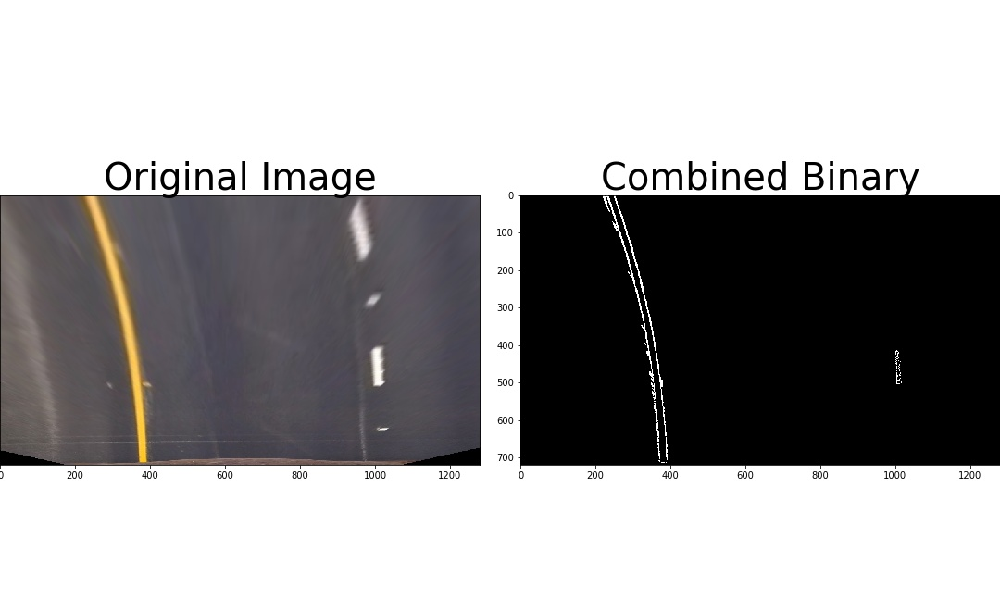
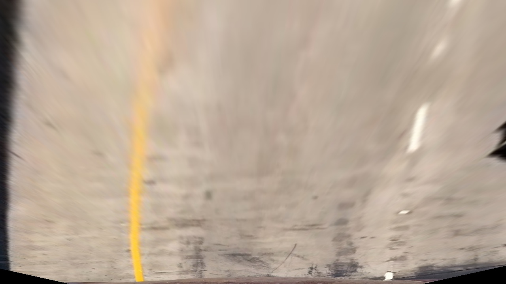

## Writeup Template


**Advanced Lane Finding Project**

The goals / steps of this project are the following:

* Compute the camera calibration matrix and distortion coefficients given a set of chessboard images.
* Apply a distortion correction to raw images.
* Use color transforms, gradients, etc., to create a thresholded binary image.
* Apply a perspective transform to rectify binary image ("birds-eye view").
* Detect lane pixels and fit to find the lane boundary.
* Determine the curvature of the lane and vehicle position with respect to center.
* Warp the detected lane boundaries back onto the original image.
* Output visual display of the lane boundaries and numerical estimation of lane curvature and vehicle position.

### Writeup / README


All of the code associated with my writeup can be found in `Advanced Lane Lines Project.ipynb`.


### Camera Calibration

#### 1. Briefly state how you computed the camera matrix and distortion coefficients. Provide an example of a distortion corrected calibration image.

I started off by creating an array of object points which represent the 3D coordinates of a real undistorted chessboard image and an array that will hold the coordinates of all of the corners of each 2D chessboard calibration image that my program reads.  My program loops through each chessboard image and finds the corners within that chessboard using  open cv’s `findChessboardCorners`  method. Those corners are saved in the `imgpoints`  array as well as saving the known object coordinates of a chessboard corners which is located in the `objp` variable. 
 
I computed the camera matrix and distortion coefficients by calling open cv’s `calibrateCamera` which takes in the object points and images points saved from earlier as parameters. 


### Pipeline (single images)

#### 1. Provide an example of a distortion-corrected image.


#### 2. Describe how (and identify where in your code) you used color transforms, gradients or other methods to create a thresholded binary image.  Provide an example of a binary image result.

I created 3 methods that generate binary images using various channels. The `rgb_select` method creates a binary image using the red, blue, or green channels of an image. The `s_select` method uses the saturation channel to create a binary image. The `l_select` method uses the lightness channel to create a binary image. Finally, the `sobel_x_select` method uses the Sobel x operator to create a binary image.  Each of these methods take in an image and a threshold value as parameters. 

I also created an interactive Jupyter widget that allowed me to see how my final binary image would look like with varying threshold values for each of the channels mentioned above. The interactive widget can be found where the `test_combined_binary` method is located. This method takes in multiple threshold values and passes those threshold values to the methods mentioned above creating a binary image that combines the color and gradient thresholds. 



#### 3. Describe how (and identify where in your code) you performed a perspective transform and provide an example of a transformed image.

I created a method called `warp`  that takes in an image, an array of  source coordinates, and an array of destination coordinates. Within the method I call open cv’s `getPerspectiveTranform` in order to calculate the perspective transform. The method I used to generated the source and destination points can be found below:

```
src = np.float32(
    [[(distorted_img.shape[1] / 2) - 55, distorted_img.shape[0] / 2 + 100],
    [((distorted_img.shape[1] / 6) - 10), distorted_img.shape[0]],
    [(distorted_img.shape[1] * 5 / 6) + 60, distorted_img.shape[0]],
    [(distorted_img.shape[1] / 2 + 55), distorted_img.shape[0] / 2 + 100]])
dst = np.float32(
    [[(distorted_img.shape[1] / 4), 0],
    [(distorted_img.shape[1] / 4), distorted_img.shape[0]],
    [(distorted_img.shape[1] * 3 / 4), distorted_img.shape[0]],
    [(distorted_img.shape[1] * 3 / 4), 0]])
```

The method above was provided in the writeup readme and was reused in this project. 



#### 4. Describe how (and identify where in your code) you identified lane-line pixels and fit their positions with a polynomial?

I created a method called  `fit_polynomial`  that performs the following steps. This method first calls the  `find_lane_pixels`  method which finds all the pixels associated with the left and right lanes by plotting a histogram of where the binary activations occur across the lower half an image,  identifying where the peaks of the histogram occurs, using those peaks to identify the general area of where the lanes are, creating boundaries/windows for each lane line, and saving all of the points associated with each of those lane lines. 

After finding the pixels associated with each lane line open cv’s `np.polyfit` method was used to fit a second order polynomial. 

#### 5. Describe how (and identify where in your code) you calculated the radius of curvature of the lane and the position of the vehicle with respect to center.

I created a method called `measure_radius_of_curvature` located in each `Line` class. This method uses the formula below to calculate the radius of curvature:

I created a method called `calculate_dist_to_lane_center`. This method takes in two `Line` objects representing both the left and right lane lines. This method finds the x intercepts of each of the lane lines, calculates the center x value between those two x intercepts, and stores that value in `lane_center`. 

The position of the cars camera is considered to be located in the middle of the image. This value is stored in `car_pos`. The method calculates the difference between `lane_center` and `car_pos` (the final value is also converted into meters).  

#### 6. Provide an example image of your result plotted back down onto the road such that the lane area is identified clearly.


### Pipeline (video)

#### 1. Provide a link to your final video output.  Your pipeline should perform reasonably well on the entire project video (wobbly lines are ok but no catastrophic failures that would cause the car to drive off the road!).

Here's a [link to my video result](./test_videos/project_submission.mp4)

---

### Discussion

#### 1. Briefly discuss any problems / issues you faced in your implementation of this project.  Where will your pipeline likely fail?  What could you do to make it more robust?

My program has a slight issue with shadows that appear on the lane lines. I believe the remedy for this issue would be to find the best color and gradient thresholds that reduce the amount of noise in each frame as well as defining a better boundary for where the pixels of each lane line might be located in. 
